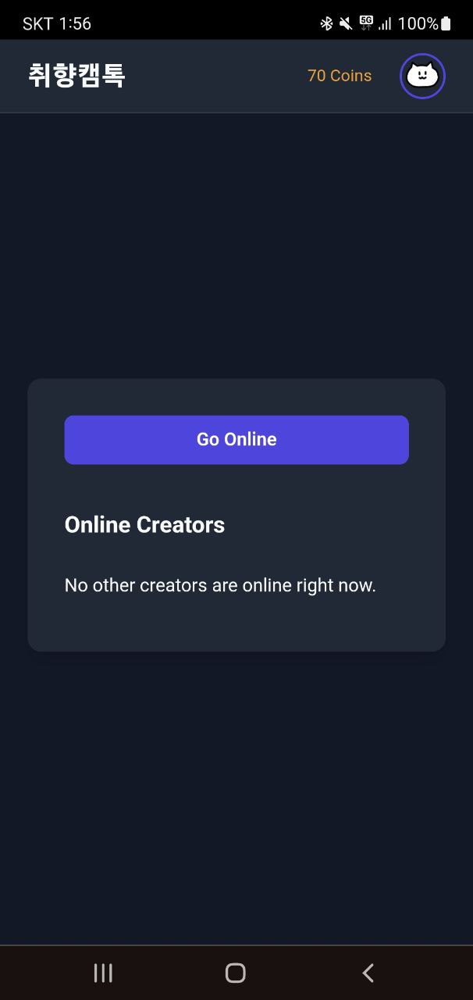

# 취향캠톡 (Taste Cam Talk)

<br/>

<p align="center">
  
</p>

<h2 align="center">관심사 기반 실시간 영상 채팅 웹 애플리케이션</h2>

<br/>

## 📖 프로젝트 소개

**취향캠톡**은 관심사를 기반으로 사용자들이 실시간으로 영상 통화를 하며 소통할 수 있는 웹 서비스입니다. Next.js와 Firebase를 중심으로 구축되었으며, WebRTC를 통해 P2P 영상 통화 기능을 구현했습니다.

<br/>

## ✨ 주요 기능

- **실시간 영상 통화**: WebRTC(simple-peer)를 이용한 1:1 영상 채팅
- **사용자 인증**: Firebase Authentication을 통한 구글 소셜 로그인
- **크리에이터 시스템**:
    - 크리에이터 전환 및 온라인 상태 표시
    - 크리에이터 프로필 페이지 (소개, 평균 별점)
- **코인 시스템**:
    - 영상 통화 시 코인 소모 (통화 시작 시, 분당 차감)
    - 코인 충전 요청 및 관리자 승인 시스템
    - 통화 후 크리에이터에게 수익 분배
    - 선물하기 기능 (코인 사용)
- **통화 품질 모니터링**: 통화 중 네트워크 상태 (Good, Average, Poor) 표시
- **통화 후 평가**: 통화 종료 후 상대방에 대한 별점 및 후기 작성
- **관리자 대시보드**:
    - 회원 관리 (역할 변경, 코인 지급/회수)
    - 통화 및 코인 사용 내역 조회
    - 서비스 주요 설정 (통화료, 정산 비율 등)
- **PWA (Progressive Web App)**: 모바일 환경에서 앱처럼 설치하여 사용 가능

<br/>

## 🛠️ 기술 스택

- **프레임워크**: Next.js (App Router), React
- **상태 관리**: Zustand
- **데이터베이스**: Firebase Realtime Database
- **인증/스토리지**: Firebase Authentication, Firebase Storage
- **실시간 통신**: WebRTC (simple-peer), Twilio (TURN 서버)
- **스타일링**: CSS Modules
- **배포**: Vercel

<br/>

## ⚙️ 시작하기

### 1. 프로젝트 클론

```bash
git clone [https://github.com/your-username/live-cam.git](https://github.com/your-username/live-cam.git)
cd live-cam
2. 의존성 설치
Bash

npm install
# or
yarn install
# or
pnpm install
3. 환경 변수 설정
프로젝트 루트에 .env.local 파일을 생성하고 아래 Firebase 및 Twilio 설정 변수를 입력해주세요.

코드 스니펫

# Firebase
NEXT_PUBLIC_FIREBASE_API_KEY=your_api_key
NEXT_PUBLIC_FIREBASE_AUTH_DOMAIN=your_auth_domain
NEXT_PUBLIC_FIREBASE_DATABASE_URL=your_database_url
NEXT_PUBLIC_FIREBASE_PROJECT_ID=your_project_id
NEXT_PUBLIC_FIREBASE_STORAGE_BUCKET=your_storage_bucket
NEXT_PUBLIC_FIREBASE_MESSAGING_SENDER_ID=your_messaging_sender_id
NEXT_PUBLIC_FIREBASE_APP_ID=your_app_id
NEXT_PUBLIC_FIREBASE_MEASUREMENT_ID=your_measurement_id

# Firebase Admin (Base64 Encoded Service Account JSON)
# JSON 파일을 Base64로 인코딩한 값을 입력해야 합니다.
FIREBASE_SERVICE_ACCOUNT=your_base64_encoded_service_account_json

# Twilio (TURN Server)
TWILIO_ACCOUNT_SID=your_twilio_account_sid
TWILIO_AUTH_TOKEN=your_twilio_auth_token
Tip: Firebase Admin 서비스 계정 키는 보안을 위해 JSON 파일을 직접 코드에 포함하는 대신, 내용을 Base64로 인코딩하여 환경 변수로 사용하는 것이 안전합니다.

4. 개발 서버 실행
Bash

npm run dev
브라우저에서 http://localhost:3000으로 접속하여 프로젝트를 확인할 수 있습니다.

📂 프로젝트 구조
/
├── app/                  # Next.js App Router 페이지
│   ├── admin/            # 관리자 페이지
│   ├── api/              # API 라우트
│   ├── creator/          # 크리에이터 프로필 페이지
│   ├── room/             # 영상 통화 룸 페이지
│   └── ...
├── components/           # 공통 컴포넌트
├── hooks/                # 커스텀 훅
├── lib/                  # Firebase, 유틸리티 함수 등
├── public/               # 정적 파일 (이미지, manifest.json)
├── store/                # Zustand 스토어
└── ...
🖼️ 스크린샷
메인 화면
